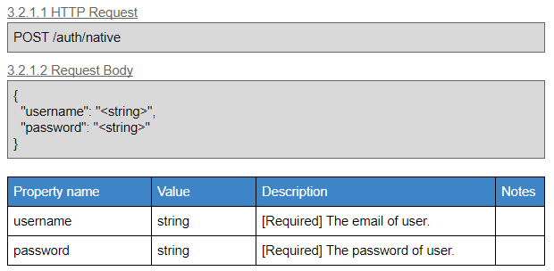
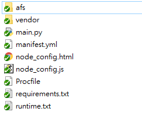
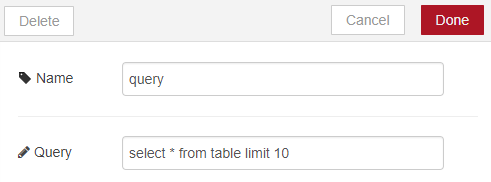

# Environment variable about CF org/space

with **AFS v1.2.17**

---

## How to use in Node-RED

### API

#### (GET) /sso/env_var
This api is in Node-RED (sso node). Use Node-RED host url.

Request headers
```js
{
    "Content-Type": "application/json"
}
```

Response body: 200
```js
{
    "_afs_instance_id": $AFS_INSTANCE_ID,
    "_afs_host_url": $AFS_HOST_URL,
    "_node_host_url": $NODE_HOST_URL,
    "_sso_host_url": $SSO_HOST_URL,
    "_rmm_host_url": $RMM_HOST_URL
}
```


#### Get SSO token
Reference to SSO doc. Version is 1.5. Use sso host url.
+ Request: `/v1.5/auth/native`


+ Response


#### Get service credential list
Reference to [AFS doc](https://portal-afs-develop.iii-arfa.com/swagger). Find below api in "services" part.
```
# use afs host url
(GET) /v1/{instance_id}/services
```


#### Get other service host url
Reference to [AFS doc](https://portal-afs-develop.iii-arfa.com/swagger). Find below api in "workspaces" part.
```
# use afs host url
(GET) /v1/{instance_id}/workspaces/{workspace_id}/env?auth_code={auth_code}
```


## How to use in python api

### Get AFS SDK for python

+ Download [AFS SDK](https://github.com/benchuang11046/afs) source code from Github.

+ Put directory: ./afs into your project.


> `main.py` is about your api main function.


### How to include in python api

#### Include afs sdk in `main.py`

```python
from afs.get_env import app_env 
from afs.flow import flow
```

#### Use flow object

##### Init flow object
Init flow object for getting environment variable and processing flow on Online Flow IDE.
```python
afs_flow = flow()    # init afs flow object
afs_flow.set_flow_config(headers_obj)   # set afs flow config
flow_list = afs_flow.get_flow_list()    # get flow list
```

`headers_obj` is variable about request headers. Like below.
```python  
headers_obj = {
    'flow_id': request.headers['flow_id'],
    'node_id': request.headers['node_id']
}
```

##### Get current node config

Get object about node config in Online Flow IDE.
`node_obj` is a python dict object which include config about user setting in Online Flow IDE.
```python
node_obj = afs_flow.get_node_item(afs_flow.current_node_id)
```

Get what user setting in Online Flow IDE. Below is user setting query string in Online Flow IDE.


The key name of query string is `query`. Then you can get query string(value) by key name, `query`.
```python
str_query = node_obj['query']
```

##### Execute next node

Use `exe_next_node()` to execute next node which is linked after current node. This function will return `error_node`, `error_msg`.
```python
error_node, error_msg = afs_flow.exe_next_node(data={'data': df_dict}, next_list=None, debug=False)
```

`df_dict` is data for sending to next node. This object is pandas object transform into python dict object.
```python
df = pd.DataFrame(values, columns=columns)
df_dict = df.to_dict() 
```

#### api response

At the end of api, set response body and status code like below. If no error_node exist, return 200. If error_node exist, return 500.
```python
if error_node=='0' :
    return jsonify({'status_code': '0'}), 200
else :
    return jsonify({'error_node': str(error_node), 'error_msg': str(error_msg)}), 500
```

