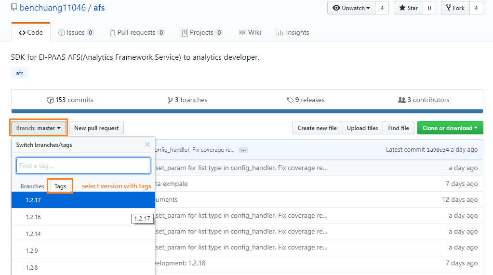
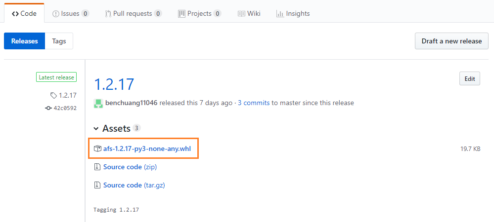

# Spec for uploading to AFS

## Node-RED需要的檔案

### HTML, JS統一用node_config命名。
+ node_config.html
+ node_config.js
+ **node的命名限制**
> + 長度3~16字元，只允許中英文大小寫、數字、特殊符號(-、_、空白)
> + node命名的名稱，需與manifest.yml中的app name相同

### HTML file必填內容的規格
+ registerType()中的匿名函數，統一命名為`node_config`。AFS動態加入code需要使用。`$NODE_NAME`的部分，帶入node名稱(需與`manifest.yml`中的app name相同)，可以參考sample code的寫法：將這個node命名為sample。
> 第一個`<script></script>`區塊中
```
RED.nodes.registerType('$NODE_NAME', node_config={})
```

+ 在registerType()外的JS需要加上一段註解，讓AFS可以動態加入其他參數設定。
> 第一個`<script></script>`區塊中，加在最後一行，可以參考`sample_node.html`中的第79行加入的位置。
```
// AFS config
```

+ node_config{ defaults:{} } 中的url欄位刪除，會由AFS加入app的url資訊。

+ Node-RED node config[預設保留的key word](https://nodered.org/docs/creating-nodes/properties)
> 不要在defaults中有相同的命名。
```
type, x, y, z, wires, outputs
```

+ 如果node為firehose start node，要多加一組key-value在defaults{}中，之後串接parser，才能找到firehose。
```
_node_type = {value: "firehose"}
```

---

## python api(.py)中的規格

+ 目前request api的預設endpoint為`/`
> AFS request的url 是app本身的host url。

+ api的port上傳CF需要為8080。

---

## APP CF push必要的檔案

+ main.py
> app執行的python。

+ manifest.yml
> + app name 命名在20個字元內，不要有空白。
> + app name 命名須與node的名稱相同。

+ requirements.txt
> `main.py`需要安裝的lib

+ runtime.txt
> 運行的python版本。

+ Procfile
> 運行`main.py`的指令。

+ ./vendor
> + `main.py`需要安裝的python lib離線包。(在可以連外的環境，可以不帶該資料夾中的內容，但如果要publish到catalog中，仍需要帶)
> + build vendor的方式可以參考[build vendor](#build-vendor)章節


## Build vendor

### Build AFS-SDK with specific version

+ 切換AFS SDK為特定版本



+ 取得AFS SDK特定版本的下載連結


+ `requirements.txt` for build vendor
`requirements.txt`中的內容為需要安裝的lib，以及AFS SDK。AFS SDK的部分為剛剛的下載連結。例如：
```
https://github.com/benchuang11046/afs/archive/1.2.17.zip
pandas
```

+ Build vendor with command line
```
# 注意build vendor的python版本，要與runtime.txt中的相同
$ cd {YOUR-APP-DIR}
$ mkdir -p vendor

# 注意python3對應使用的pip，需要使用pip3或是pip
$ pip3 install --download vendor -r requirements.txt
```

+ 加入AFS SDK的whl

先將資料夾./vendor中的`afs-1.2.17.zip`刪除，再到github上下載AFS SDK的whl放入./vendor中。




+ modify `requirements.txt` for upload to AFS

將`requirements.txt`中，AFS SDK原本為連結的部分，修改為afs。例如：
```
afs
pandas
```

