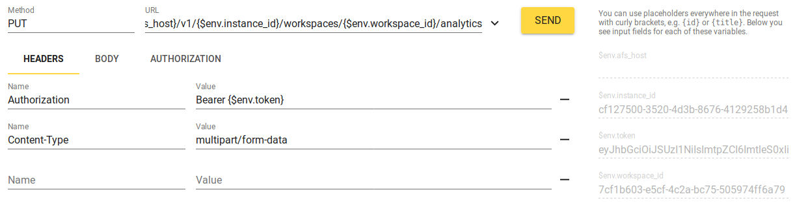
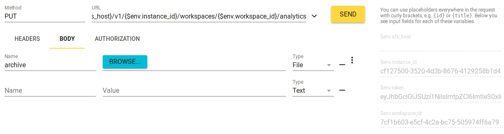
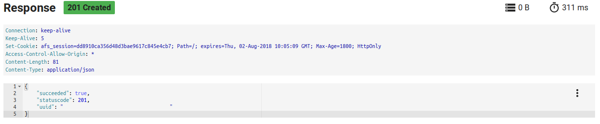
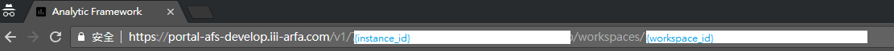

# Step for uploading app to AFS

### 準備檔案

+ 注意需要上傳的檔案規格。參考[spec_flow.md](./spec_flow.md)。
+ 壓縮檔：在project中，直接壓縮所有檔案。 (不要將project的folder做壓縮)

### 上傳

+ api
`(PUT) /v1/{instance_id}/workspaces/{workspace_id}/analytics`

+ request headers：設定content的類型與SSO token。
> **若使用Postman上傳zip檔案，不要帶入`Content-Type`的欄位。**

+ request headers：選擇要上傳檔案的zip。

+ response result

+ instance_id、workspace_id：登入AFS portal之後的url中。

